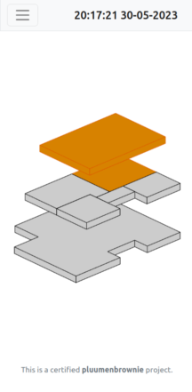
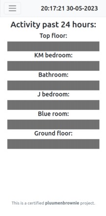

# Heatzone by pluumenbrownie/Wessel Beumer
This project allows us to observe the status of the floor heating in our house,
both in the present and the past.






The valves of the floor heating system in our house are managed by a homemade 
system, based on an arduino. This system is not very transparent, however, and
that's where this app comes in. This website/app allows us at home to get 
better insight into the status of our home heating to anyone connected to our
WiFi network. 

This project can be split up in two parts:
 1. The listener
 1. The webinterface

This split architecture allows you to, for example, update the website without 
having to stop the data collection of the listener. 

# Installation
The first step, after cloning the repo, is to create a conda enviroment with the following modules:
```
conda install pyserial flask flask-session sqlalchemy psycopg2 numpy drawsvg
```
After activating this enviroment, also install `tmux` and `postgresql` via the 
installer of your linux distro (only Linux is officially supported, other OS's
likely require hacks).

## Postgresql
When first setting up postgresql, you will first need to add a password to your 
postgres user and add your current user to postgres. Use the following links to 
install and add the account:
- https://www.geeksforgeeks.org/postgresql-psql-commands/
- https://learn.microsoft.com/en-us/windows/wsl/tutorials/wsl-database#install-postgresql
- https://phoenixnap.com/kb/postgres-create-user

After this, open psql as the postgres user and create a database called `heating`
via:
```
CREATE DATABASE heating;
```
Connect to `heating` with either the psotgres- or the local useraccount:
```
\c heating
```
then create the `direct_history` table with the commands provided in 
`make_direct_history.sql`. The database should be ready after this. Close the 
psql terminal with `\q`.

## Starting the listener
For this project, two programs have to be able to run independantly of one another.
Also, when setting up the programs via SSL, the program you started via your 
standard terminal would just stop running when closing the connection. Therefore, 
I used `tmux` to be able to run multiple programs side-by-side. When installed, use
```
tmux new -s listener
```
to create a new session called *listener*. In this session, activate the correct
conda enviroment and run the 
```
python listener.py
```
to start the listener. You 
should be prompted for the database password for your user. If set up correctly,
the program should now start collecting and storing data, and print recieved data
to the console. Detach from the tmux screen by quickly pressing `Ctrl+b` and then 
`d`. To get back to the *listener* session, use
```
tmux attach -t listener
```
Here are more links to help with using tmux:
 - https://www.howtogeek.com/671422/how-to-use-tmux-on-linux-and-why-its-better-than-screen/
 - https://superuser.com/questions/209437/how-do-i-scroll-in-
 
## Flask and everything else
To get the website up, start a new tmux session named *flask* with
```
tmux new -s flask
```
Activate the conda enviroment, check whether you are in the right file, and run
```
flask run --host=0.0.0.0
```
to expose the website to your entire local network. You will also be reprompted to 
give your database password. The website should now be available on `*local ip 
address*:5000` (flask should show this address when started). Now detach from the
tmux session.

Everything should now be running. If you are running these programs on a laptop,
you might want to be able to turn of it's screen. Try one of the methods in this
discussion for this:
https://askubuntu.com/questions/62858/turn-off-monitor-using-command-line

# Thanks and acknowledgements
Thanks to my dad for providing and walking me through the arduino source code and 
helping me with the home networking. 
Additional thanks go out to the assistants of the programmeren minor and the 
creators of the modules used for this project.
This project uses PySerial to communicate with the arduino: 
https://pyserial.readthedocs.io/en/latest/examples.html
