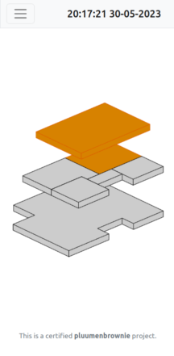
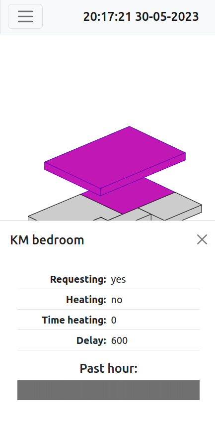

# Heatzone by pluumenbrownie/Wessel Beumer
This project allows us to observe the status of the floor heating in our house,
both in the present and the past.

The valves of the floor heating system in our house are managed by a homemade 
system, based on an arduino. This system is not very transparent, however, and
that's where this app comes in. This website/app allows us at home to get 
better insight into the status of our home heating to anyone connected to our
WiFi network. 

# Postgres links:
https://www.geeksforgeeks.org/postgresql-psql-commands/
https://learn.microsoft.com/en-us/windows/wsl/tutorials/wsl-database#install-postgresql
https://phoenixnap.com/kb/postgres-create-user

# PySerial
https://pyserial.readthedocs.io/en/latest/examples.html

# Turn of laptop screen
https://askubuntu.com/questions/62858/turn-off-monitor-using-command-line

# tmux
https://www.howtogeek.com/671422/how-to-use-tmux-on-linux-and-why-its-better-than-screen/
https://superuser.com/questions/209437/how-do-i-scroll-in-tmux